```{r setup, include=FALSE}
knitr::opts_chunk$set(echo = FALSE)
```

Niniejsza instrukcja prezentuje sposób rejestracji kont pracowników Akademii Leona Koźmińskiego na platformie Oracle Academy.

### Stworzenie ogólnego konta Oracle

1. Wchodzimy na stronę: <https://academy.oracle.com/>.

2. Klikamy `Sign In/Register for Account`.

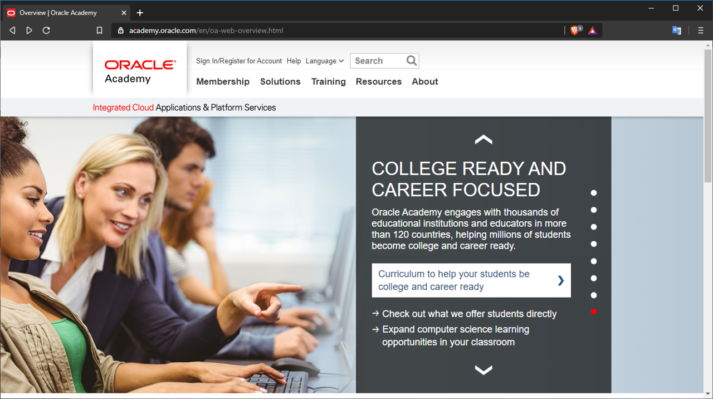

3. Wybieramy `Join Today` w sekcji `Join Oracle Academy`.

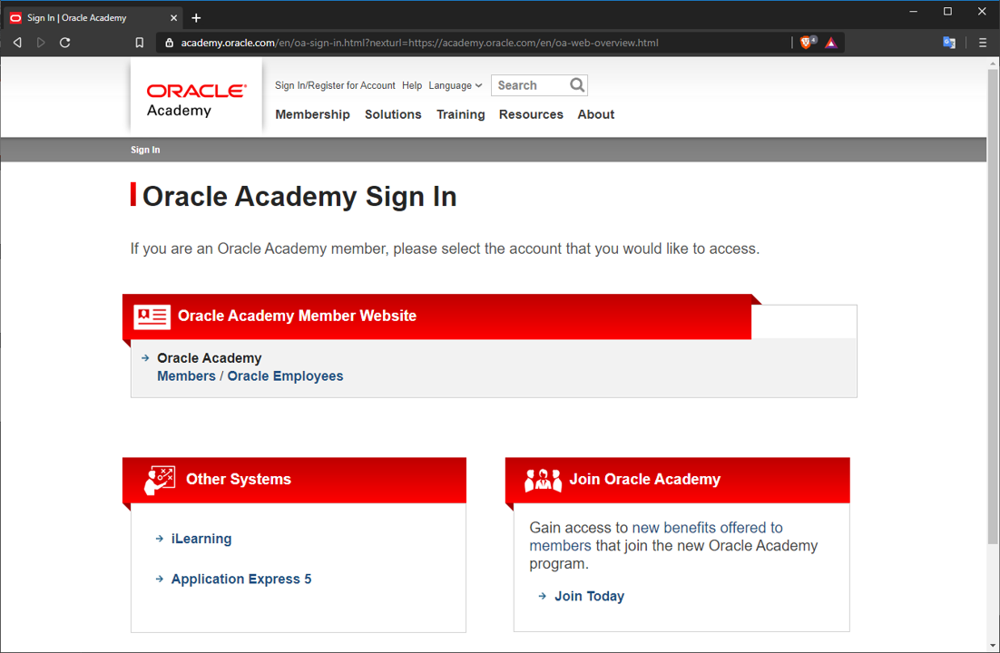

4. W ramach `Step 1` wybieramy `I Do Not Have...` i w rozwijącym się menu dalej `Create Your Oracle Account...`.

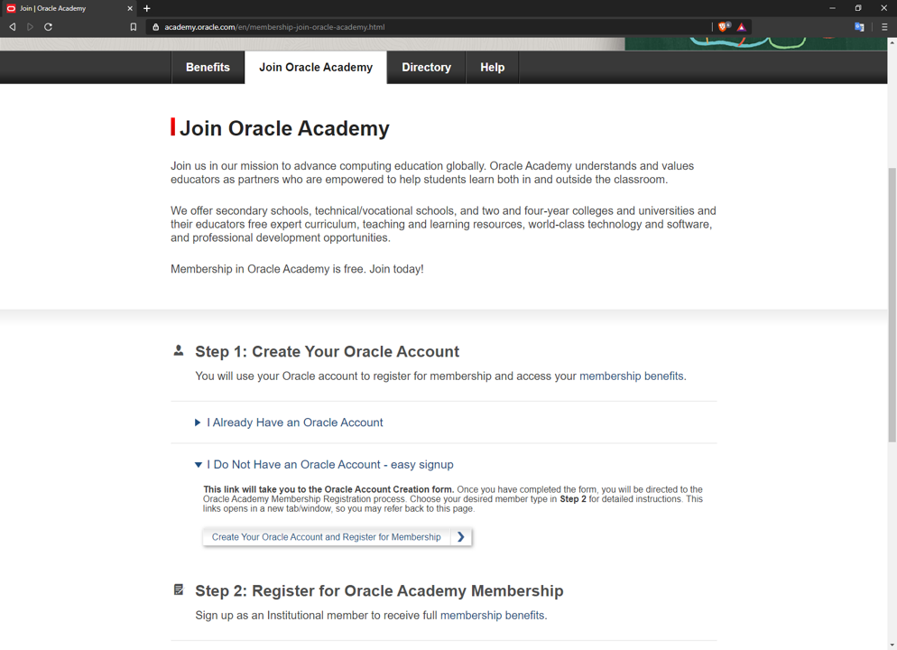

5. Uzupełniamy długi zestaw pól. Oczywiście możemy podać adres i telefon uczelni. Adres emailowy **MUSI** być w domenie @kozminski.edu.pl. Nazwę uczelni podajemy jako `Akademia Leona Koźmińskiego`, a nie `Kozminski University`.

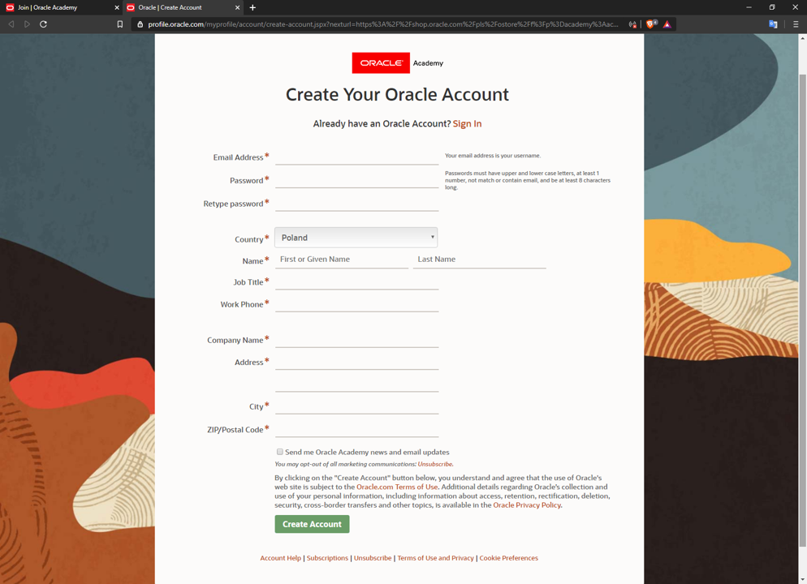

6. Powinniśmy dostać prośbę o zweryfikowanie adresu email poprzez kliknięcie linku w wysłanej na nasz adres wiadomości.

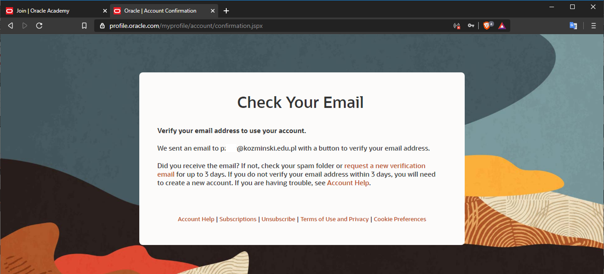

7. Po kliknięciu w link dostajemy wiadomość, że nasze konto jest gotowe do użycia.

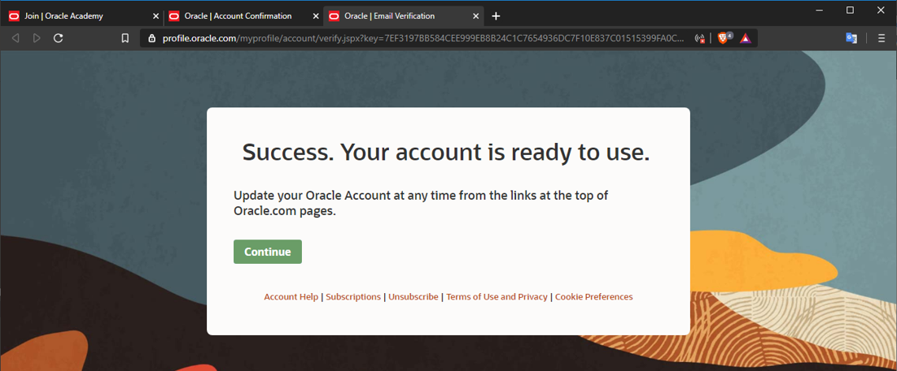

8. Wybranie opcji `Continue` może przekierować nas do dalszego ciągu zgłoszenia do Oracle Academy albo na główną stronę Oracle. Jeśli trafiliśmy na stronę `Membership Registration and Ordering` w Oracle Academy, **możemy pominąć punkty 9-11 niniejszej instrukcji**.

### Wniosek o konto Oracle Academy

9. Jeśli po potwierdzeniu konta trafiliśmy na główną stronę Oracle, powróćmy na podstronę Join Oracle Academy, która nadal powinna być otwarta w naszej przeglądarce.

10. Teraz możemy już wybrać `I Already Have an Oracle Account` i w rozwijanym menu `Sign In to Your Account...`.

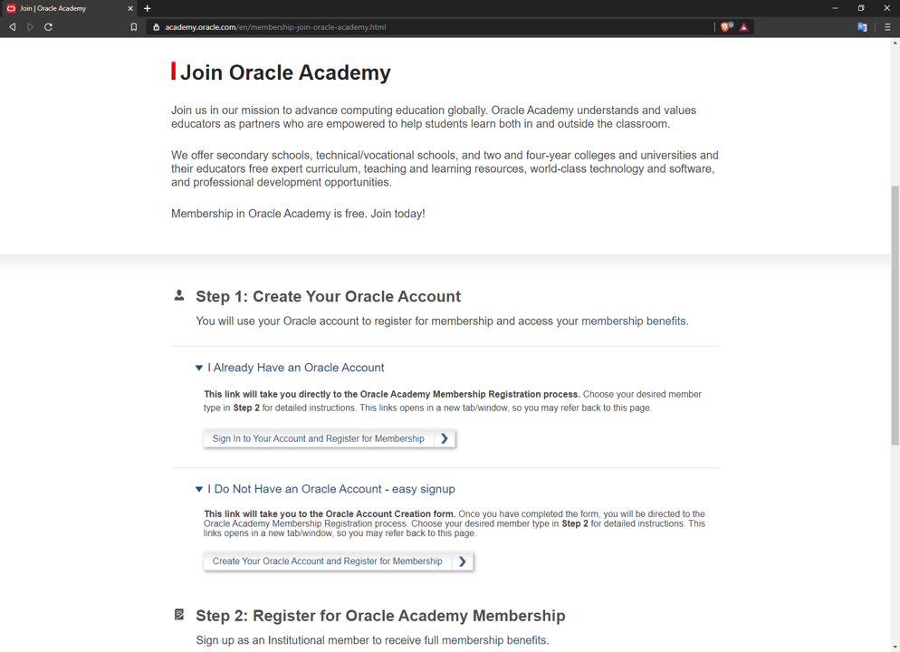

11. Na nowym ekranie logowania musimy wprowadzić dane naszego konta Oracle.

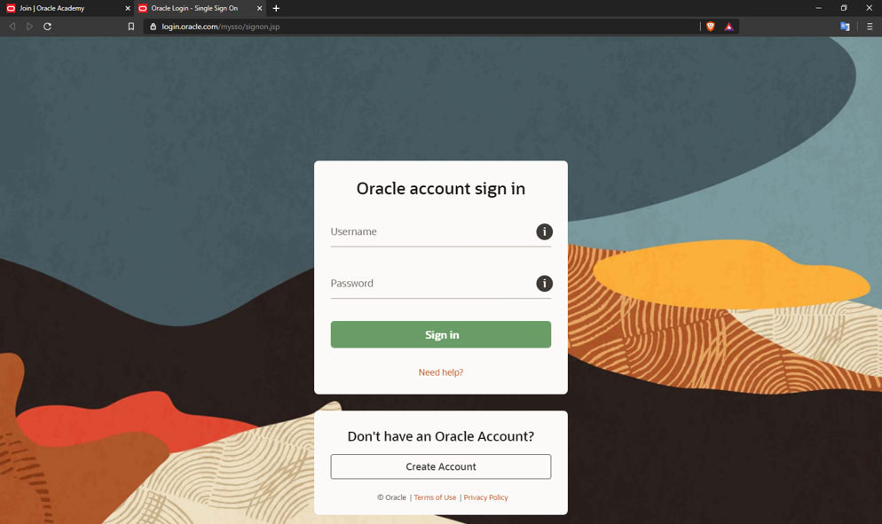

12. Na stronie `Membership Registration and Ordering` wybieramy `Register My Institution` w sekcji `Institutional Membership`.

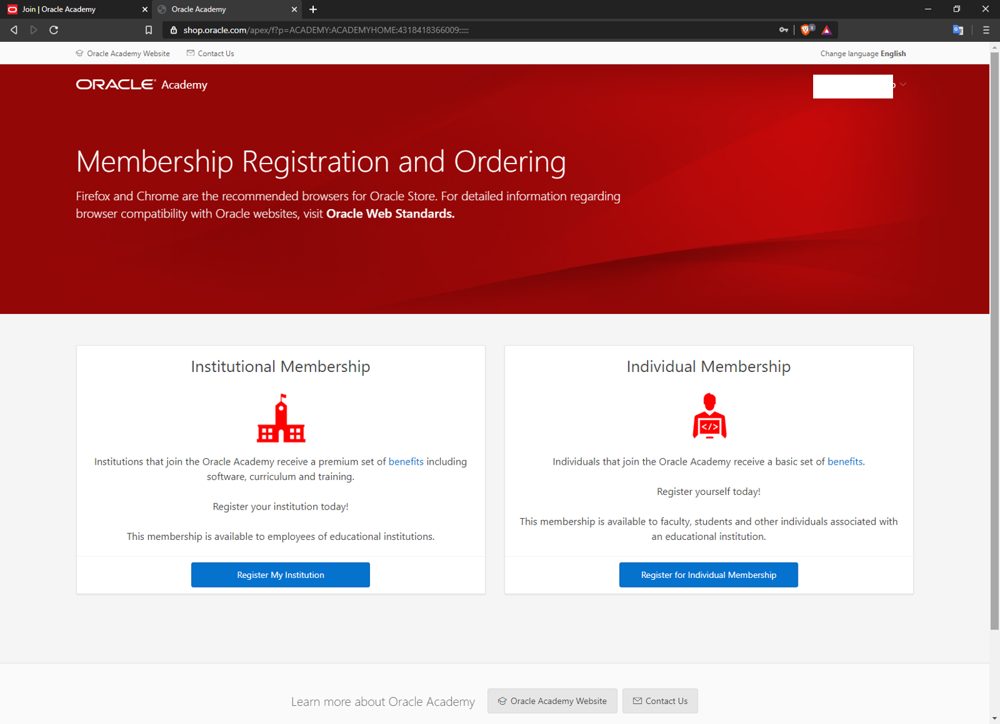

13. W wyszukiwarkę instytucji wpisujemy `Akademia Leona Koźmińskiego` i zatwierdzamy wyszukiwanie.

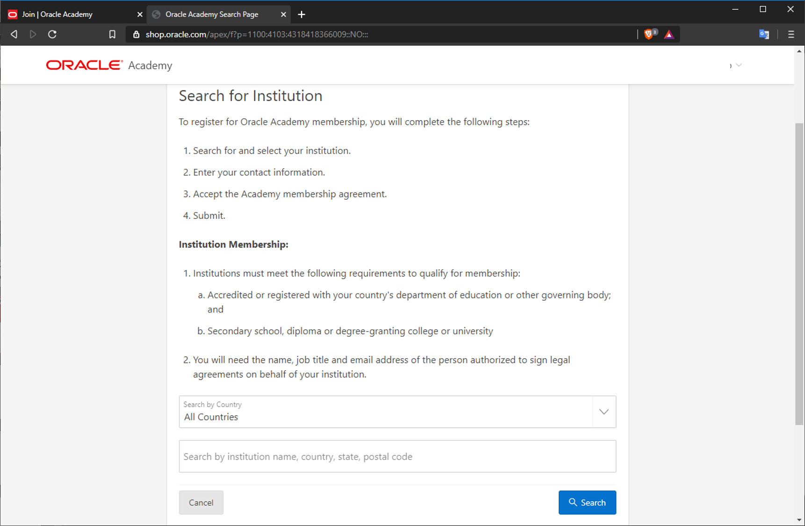

14. Po poprawnym wyszukaniu klikamy na nazwę uczelni.

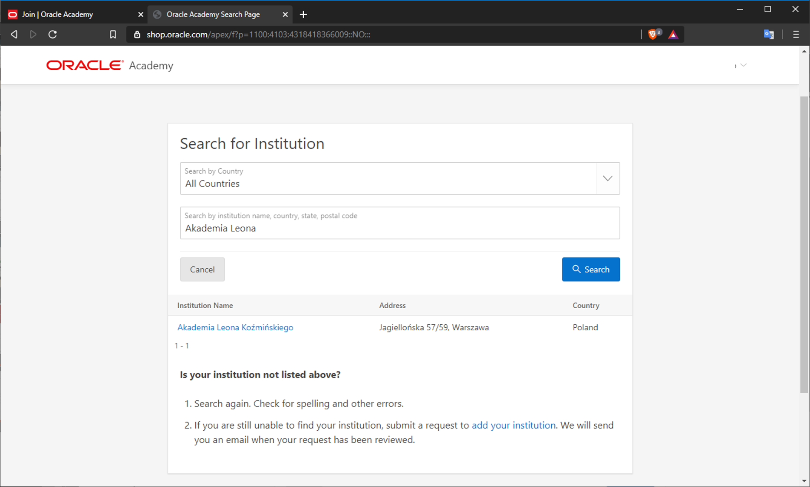

15. W formularzu `Contact Information` znów wpisujemy długą listę danych na swój temat. Ważne, by wybrać `Faculty` w `Job Title`.

16. Zaznaczamy zgodę w okienku przy `I will abide...`.

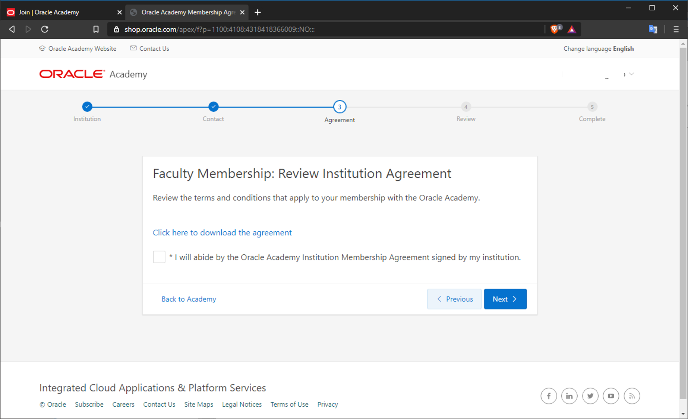

17. Sprawdzamy poprawność danych w formularzu `Review and Summary`.

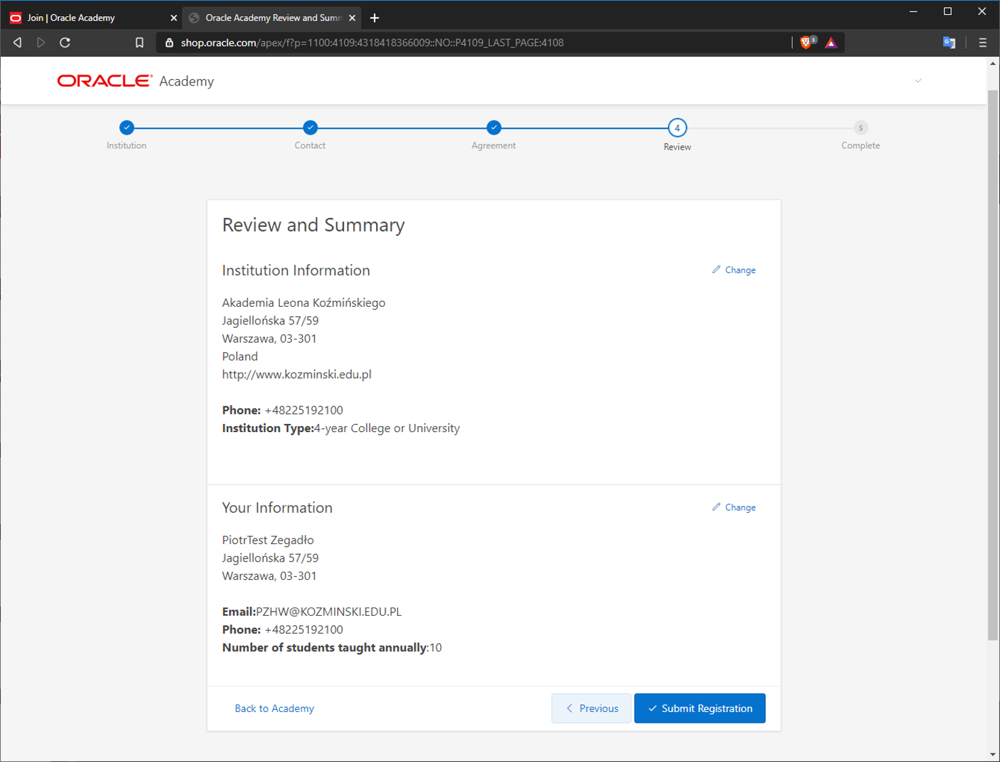

18. Gratulacje! Aplikacja przesłana. Do 48 godzin powinno przyjść potwierdzenie rejestracji.

### Dostęp do iLearning i Cloud

19. Dostęp do pełnych zasobów Oracle Academy wymaga jeszcze wystąpienia o dostęp do platformy iLearning z materiałami, które można udostępniać studentom. Przyda się też dostęp do chmury.

20. W zakładce `Curriculum` wybieramy opcję `iLearning`, a potem z prawej strony `Request iLearning Account`.

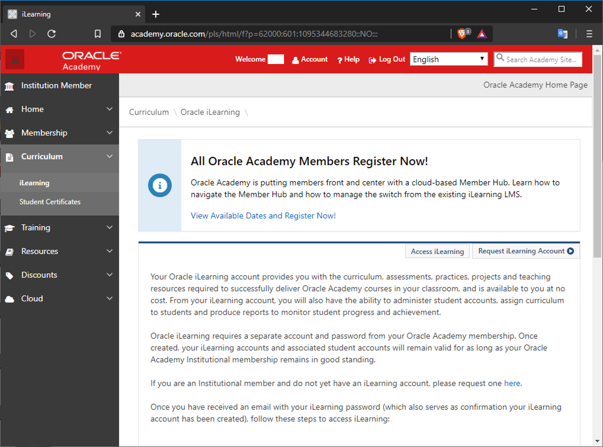

21. W zakładce `Cloud` wybieramy `Oracle Academy Cloud Program` i klikamy `Request Oracle Academy Cloud Program Accounts`.

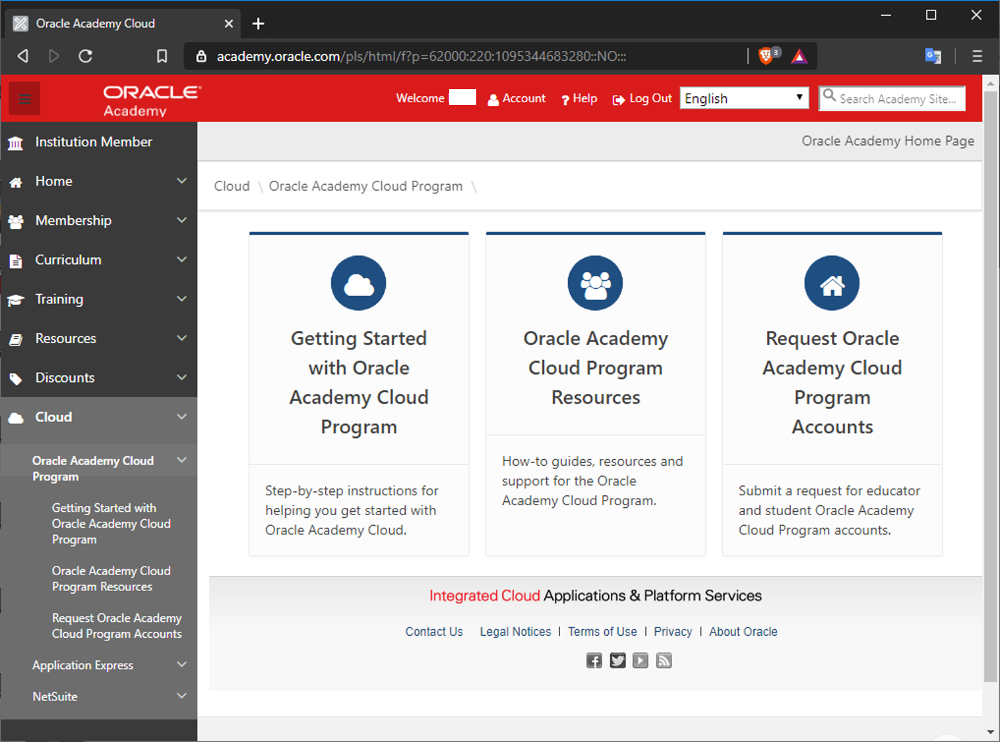

22. Czekamy na przyznanie dostępów - i gotowe.